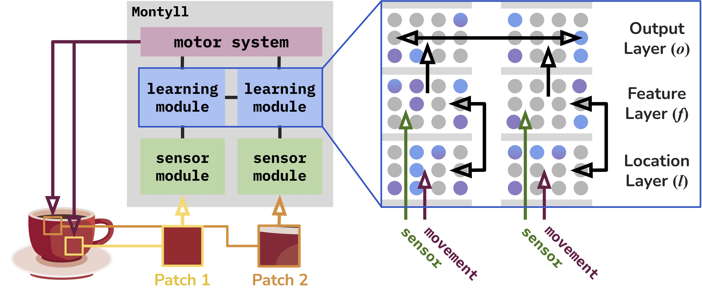

# `cmontyll`: A high-performance C implementation of Montyll, a novel Thousand Brains System



<ins>Montyll</ins> stands for <ins>Monty</ins> <ins>l</ins>ow-<ins>l</ins>evel, as it is inspired from N. Leadholm et al.'s implementation named _Monty_ ([code](https://github.com/thousandbrainsproject/tbp.monty), [paper](https://arxiv.org/abs/2507.04494)), but integrates elements of low-level neocortical processing e.g. accurate neuron models [^1][^2] and grid cells to represent location [^3][^4]. Montyll was explicitly designed to be aligned with the long term goals of the Thousand Brains Project ([website](https://thousandbrains.org), [paper](https://arxiv.org/abs/2412.18354)). It is written in C for performance and to be amenable to architectural studies.

## Getting started

To compile the code
```
git clone git@github.com:Xavier0301/cmontyll.git cmontyll
cd cdmontyll
make
```
To run Montyll for 100 steps:
```
./main 100
```

### Single learning module mode

```
make main
``` 
compiles with no optimization (`-O0`) and 
```
make main_opt
``` 
compiles with all optimizations (`-O3`). To run the code for 100 steps
```
./main 100
```
```
./main_opt 100
```

### Multiple learning modules mode

For many learning modules:
```
NUM_NEIGHBORS=20 make scale-out
``` 
compiles the code and assumes each LM is connected to 20 other LMs. To run the code for 100 steps, across 50 learning modules:
```
OMP_NUM_THREADS=50 ./scale-out 100
```
On macos on an m2 pro 12-core chip, `libopenmp` somehow limits the number of threads to 248. To escape this limitation, compiles with gcc
```
brew install gcc
GCC_BIN=/path/to/gcc
OMP_NUM_THREADS=50 ./scale-out-gcc 100
```
although the performance is not great since `sys` time explodes around 250 learning modules.

### Printing stuff

To enable printing the states and other useful informations, use `PRINT=0` (none), `PRINT=1` (standard) or `PRINT=2` (verbose) at compile time:
```
PRINT=2 make main
./main 10
```

[^1]: J. Hawkins and S. Ahmad, “Why neurons have thousands of synapses, a theory of sequence memory in neocortex,” Frontiers in neural circuits, vol. 10, p. 23, 2016

[^2]: S. Ahmad, A. Lavin, S. Purdy, and Z. Agha, “Unsupervised real-time anomaly detection for streaming data,” Neurocomputing, vol. 262, pp. 134–147, 2017

[^3]: M. Lewis, S. Purdy, S. Ahmad, and J. Hawkins, “Locations in the neocortex: A theory of sensorimotor object recognition using cortical grid cells,” Frontiers in neural circuits, vol. 13, p. 22, 2019

[^4]: N. Leadholm, M. Lewis, and S. Ahmad, “Grid cell path integration for movement-based visual object recognition,” arXiv preprint arXiv:2102.09076, 2021
